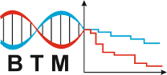
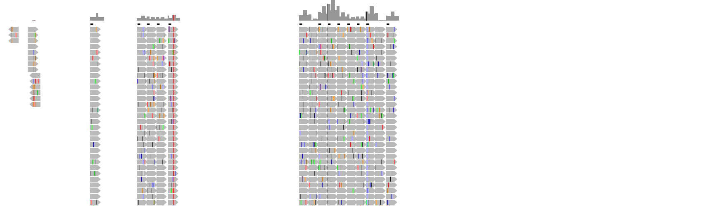

 
     

I will try to put updates on my Polonez fellowship here, together with some materials, links and other useful information.
Major updates on [Remus](https://github.com/seru71/Remus) development should also find its way on the timeline down here.

Some basic information about the project's scope and aims can be found on hosting department [pages](https://biostat.umed.pl/polonez.php).

----

## May 23rd, 2019
After a longer break, a new release of Remus is out - [v0.4](https://github.com/seru71/Remus/releases/tag/v0.4).
Starting from this version, hg19 and hg38 ENCODE data are lifted over to hg38 and hg19 (respectively), joined, and used for querying enhancer and available chromatin regions.
Similarly, hg19-based FANTOM5 promoter and enhancer data is lifted over to GRCh38. 
Support for both genome build to full extent.

## April 18th, 2019
Yesterday I came back from a very inspiring study visit at [MNM.bio](http://mnm.bio). 
Look forward to cutting-edge whole-genome analystics in rare-disease and cancer diagnostics!

## April 5th, 2019
I have spent some time recently tuning a custom pipeline that will be used here at [BTM](http://biostat.umed.pl) to process NGS data from microRNA profiling experiments.
Tested out three different mappers, several approaches and settled on one that is implemented as a default path [this one](https://github.com/seru71/microrna-profiling-pipeline).
In short, UMI-extraction, followed by bowtie2 local mapping to forward strand of [miRBase](http://mirbase.org) mature miRs, and separate counting of unique and multimapping reads.
Plus some QC stats generation. All stitched together with [Ruffus](http://www.ruffus.org.uk). 
Help yourselves, if you fancy.

## April 3rd, 2019
Remus has gotten its permanent URL: [http://remus.btm.umed.pl](http://remus.btm.umed.pl).
Currently it points to a test/development version of the tool, but I hope to be ready to provide a production release soon.

## March 19th, 2019
We will be going to Gothenburg to present [Remus](https://github.com/seru71/Remus) and our study on HNF1B-MODY at [ESHG 2019](https://2019.eshg.org/). 
Looking forward to many great talks and meeting some colleagues from abroad.

## February 5th, 2019
And here is an example of igv-screenshooter-html in action on some trio data: [igv-screenshooter-trio.html](materials/igv-screenshooter_trio_example.html)

## January 10th, 2019
Let me introduce [Dawid](https://github.com/dawidsielski), student of final year of Applied Computer Science at [Lodz University of Technology](https://www.p.lodz.pl/en). 
I will be co-supervising Dawid's MSc thesis where he develops a system for sharing genetic variant frequency data. 
Check out projects's repo [here](https://github.com/dawidsielski/medical-data-share).

## November 19th, 2018
BTM team participated in [Gliwice Scientific Meetings](http://gsn.io.gliwice.pl) conference, where Remus was presented on a [poster](materials/GSM18_poster.pdf).

## November 15th, 2018
I have a pleasure to announce that Remus supports hg38 now. 
The master branch contains liftover code for both ENCODE and FANTOM5 data, which are lifted over both ways, i.e. hg19->hg38 and hg38->hg19.
In the [last minor revision](https://github.com/seru71/Remus/releases/tag/v0.3.2) few performance improvements were also added.

## November 12th, 2018
I was invited to give a talk at excellent PhD School in Molecular Medicine organized by prof. Bożena Kamińska. 
Had a great time in Krakow presenting my view on shift from WES to WGS in medical diagnostics of rare disorders, and an update on Remus development.
The slides are [here](materials/SMM18_presentation.pdf).

## November 9th, 2018
Had a great time at Intelliseq and some good fun implementing [IGV-screenshooter](https://github.com/seru71/igv-screenshooter-html).
Check it out! 

## November 5th, 2018
I am starting a study visit at [Intelliseq](http://www.intelliseq.pl) today. Looking forward to great discussions, exchange of experience, and some practical work done.

## September 5th, 2018
This year's [Polish Bioinformatics Society](https://www.ptbi.org.pl) Symposium ([PTBi2018](http://ptbi2018.pwr.edu.pl)) is taking place in Wrocław. 
I have a pleasue to present a flash talk on [improving detection accuracy of duplications](materials/PTBI2018.pdf).

## July 3rd, 2018
[Damian](https://github.com/DamianSkrzypczak) has passed his MSc exam yesterday. 
As part of his thesis under my co-supervision Damian developed [Remus](https://github.com/DamianSkrzypczak/Remus). I will be continuing this work and keep extending the software in this [fork repo](https://github.com/seru71/Remus).
Stay tuned!

## June 29th, 2018
I am at excellent bioinformatics conference in Toruń - [BIT18](https://www.ptbi.org.pl/website/conferences/bit2018/), [presenting Remus](materials/BIT18.pdf). 

## May 29th, 2018
Today I visited fellow bioinformaticians from [Biostatistics Group](http://theta.edu.pl) at [Wroclaw University of Enviromental and Life Sciences](https://www.upwr.edu.pl/en). 
I was invited for a presentation for students of BSc and MSc programmes to talk about my work.
I took this opportunity to also presented them a list of volountary summer projects where they could get some programming practice and hands-on experience with NGS data analysis. 
Maybe our group will source some bioinformatitians from this crowd...

## May 24th, 2018
Continuing the search for patients for the project: this time at the XIX Congress of the [Polish Diabetological Association](https://cukrzyca.info.pl) in Katowice ([PTD 2018](http://19ptd.pl)). 
Here are [slides](materials/PTD2018.pdf) of a short presentation (in Polish).

## May 11th, 2018
Let me introduce [Damian](https://github.com/DamianSkrzypczak) who has been working with me on [Remus](https://github.com/DamianSkrzypczak/Remus),
a web application that will facilitate analysis of regulatory variats in WGS data.
The project is the practical part of Damian's MSc thesis at the Department of Genetics of [Wroclaw University of Enviromenal and LIfe Sciences](https://www.upwr.edu.pl).
PS
Remus is for REgulatory MUtation Search.

## April 23rd, 2018
Today I am at meeting of [Pediatric Section of the Polish Diabetological Association](https://www.polpediab.edu.pl) meeting people and spreading news about the project. 
Slides for my presentation are [here](materials/PolPeDiab2018.pdf).

---

This project is funded by NCN Polonez grant no 2016/23/P/NZ2/04251. This project has received funding from the European Union’s Horizon 2020 research and innovation programme under the Marie Skłodowska-Curie grant agreement No 665778.

